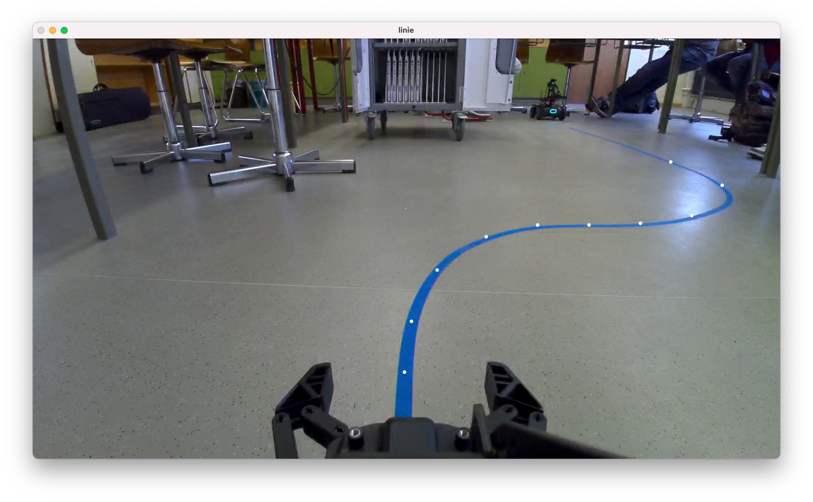

# Linienerkennung



## Übersicht
Das Programm besteht aus mehreren Teilen. Einige sind nicht vollständig fertiggestellt/funktionsfähig. Das Programm benötigt die numpy/scipy-Pakete.

### [`stack.py`](stack.py)

Die Klasse `ActionStack` umschließt eine `Deque`, die nach dem "Last In First Out"-Prinzip wie ein Stapel funktioniert. Befehle (als Klassenobjekte des Typs `BaseAction`) können auf diesen Stapel gelegt werden. Soll eine oder mehrere Aktion(en) rückgängig gemacht werden, können die Befehle vom Stapel nacheinander herabgenommen werden. Diese Befehle können nun umgekehrt an den Roboter gesendet werden, um diese rückgängig zu machen.
Es ist auch möglich ein `Checkpoint`-Objekt auf diesen Stapel zu legen. Dieser kann zum Beispiel an einer Kreuzung gesetzt werden, um später dorthin zurückzukehren, sollte der falsche Weg gewählt worden sein. Der Roboter kehrt automatisch zum letzten Checkpoint zurück, wenn die Methode `undo_until_checkpoint` der Klasse `ActionStack` aufgerufen wird. 

```python
# Solange rückgängig machen, bis ein Checkpoint-Objekt auf dem Stack liegt
def undo_until_checkpoint(self):
    while self.count() > 0:
        if self.peek().is_checkpoint():
            break
        self.pop().undo()
```
### [`actions.py`](actions.py)

Um den Code zu vereinfachen, wurden Befehle, die den Roboter bewegen in eigene Klassen versetzt, die von einer gemeinsamen Klasse erben. Die Klassenstruktur ist folgendermaßen aufgebaut:
```
            ------ BaseAction ------
          /             |            \
     Checkpoint    AsyncAction    SyncAction
                        |             |
                 DriveSpeedAction  MoveDistanceSyncAction 
```

Eine Aktion die von `SyncAction` erbt, führt einen synchronen Befehl aus, der automatisch stoppt, wie zum Beispiel `MoveDistanceSyncAction` (Fahren einer bestimmten Streckenlänge). Das heißt, der Funktionsaufruf blockiert den Code solange, bis der Befehl fertig ist. Die erbende Klasse muss die Funktionen `def exec()` (Befehl ausführen) und `def undo()` (Befehl rückgängig machen) implementieren.

`AsyncAction` hingegen wird bei asynchronen Befehlen verwendet, die eine unbestimmte Zeit andauern können. Ein derartiger Befehl wird mit der Funktion `def begin()` gestartet und mit `def end()` gestoppt. 
`DriveSpeedAction` hat  keine bestimmte Dauer und läuft asychron zum restlichen Programm im Hintergrund. In diesem Fall wird die verstrichene Zeit zwischen Aufruf der begin/end() Funktion gespeichert, so dass es möglich ist, mit einem Aufruf von `def undo()`, die Aktion wieder rückgängig zu machen.

Diese wiederverwendbaren Hilfsklassen helfen den Code zu vereinfachen und sind mit dem `ActionStack` kompatibel:

```python
action = DriveSpeedAction(ep_robot, x=0.5) # mit 0.5m/s in x-Richtung
action.begin() # Bewegung starten
# [...]
if bedingung:
    action.end() # Bewegung stoppen
    action.undo() # Bewegung rückgängig machen
```

